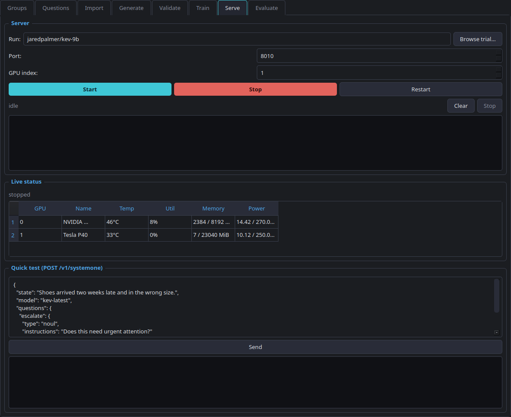
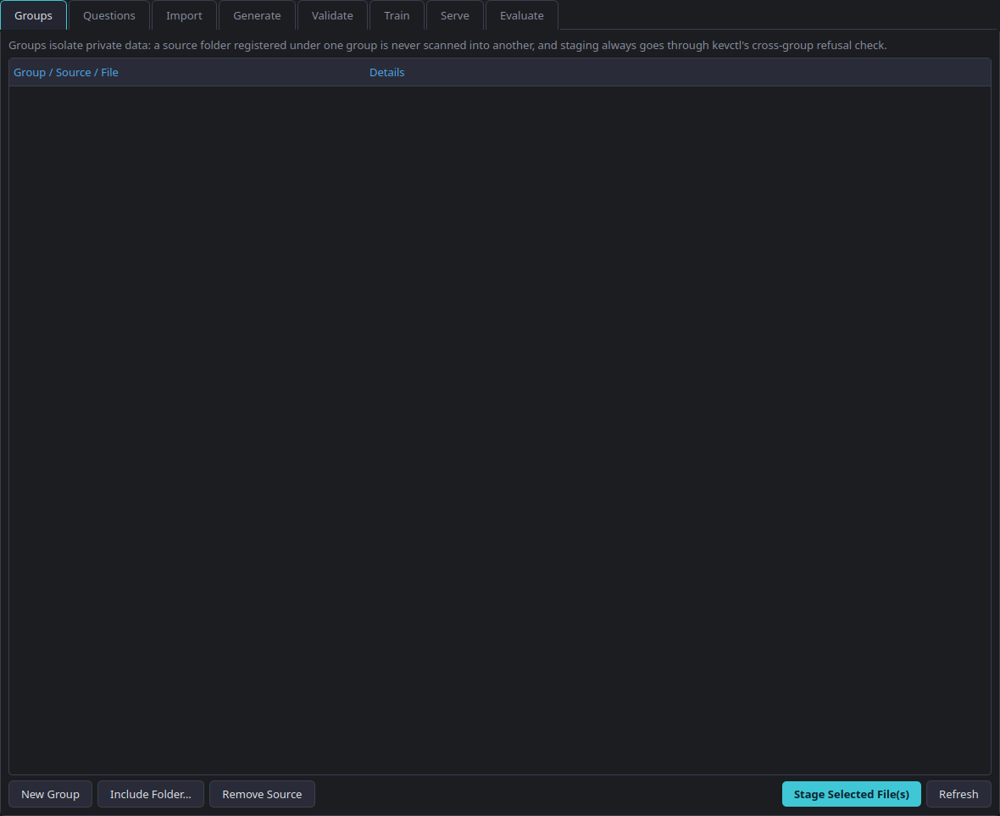
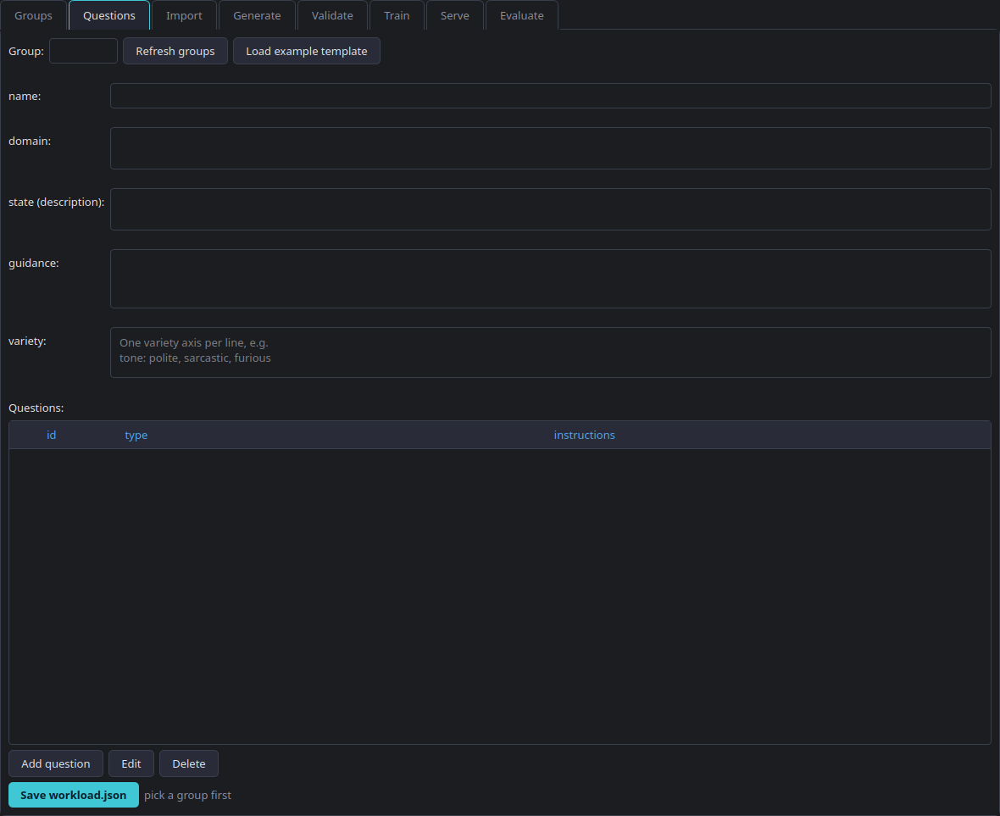

# Kev Control Panel

A local-only, dark-mode desktop GUI for [Kev](https://github.com/jaredpalmer/kev) — the
open reconstruction of Jev/TypeSafe's System One decision models. It wraps the whole
fine-tuning workflow (data import, question design, generation, validation, training,
serving, evaluation) in one control panel, and adds group-isolated private data handling
and a scratch-trial training model that Kev itself doesn't have.



## Why this exists

Kev ships as a collection of standalone CLI scripts (`kev.serve`, `kev.train`,
`kev.benchmark`, plus the `kev-finetune` skill's data-prep scripts). That's fine for one-off
runs, but it gets unwieldy fast once you're juggling several unrelated fine-tuning projects
on the same machine, each with its own private data, and you want to actually *see* what's
using your GPU instead of guessing.

This tool adds:

- **A tabbed GUI** over every stage: Groups, Questions, Import, Generate, Validate, Train,
  Serve, Evaluate — each one a thin wrapper around the real underlying script or CLI, not a
  reimplementation.
- **Group isolation.** Register a folder of data under a group, and it's staged into that
  group's own directory. A different group's training run or `--init-from` is refused by
  default unless you explicitly override it — private data for one project can't silently
  leak into another.
- **Scratch trials, not permanent checkpoints.** Every training run writes to a fresh,
  timestamped, disposable trial directory. Nothing is "the" model until you decide it is;
  a trial you don't like is one click to discard.
- **Hard-offline by default.** Every subprocess this GUI launches inherits a policy of
  `HF_HUB_OFFLINE=1` / `TRANSFORMERS_OFFLINE=1`. Once a model is cached locally, nothing
  here will reach `huggingface.co` again on its own — not a freshness check, not metadata,
  nothing — unless you explicitly opt in for that one run.
- **A combined-results ledger.** Every evaluation run (baseline or fine-tuned, any group)
  gets appended to one running table — accuracy, Brier score, ECE, coverage-at-5%-error —
  so you can compare trials against each other and against the released checkpoint over
  time, not just read one report and forget it.

## Tabs

| Tab | Wraps | What it does |
|---|---|---|
| **Groups** | — | Tree-style tracker: register any folder per group, recursively scans it for CSV/JSON/JSONL, stage individual files into that group's isolated data directory |
| **Questions** | — | CRUD editor for a group's `workload.json` — the question/answer schema (`choice`/`noul`/`score`) that drives everything downstream |
| **Import** | `extract_workload.py`, `convert_data.py` | Scan a codebase for existing Jev/TypeSafe call sites, or convert a CSV/TSV/JSONL export of labels into Kev's record format |
| **Generate** | `generate_data.py` | Synthesize balanced labelled training data from just a question spec. Defaults to a **local Ollama** endpoint, not the script's own OpenAI default — cloud requires explicitly opting in |
| **Validate** | `split_data.py`, `plan_size.py` | Validate records against the schema, split into train/calibration/development, and estimate how much data you'd need to detect a meaningful gain before you bother training |
| **Train** | `kevctl train` | Group-isolated, hard-offline, LoRA fine-tuning into a scratch trial |
| **Serve** | `kevctl start/stop/restart` | Live GPU dashboard (temp/utilization/memory/power, real `nvidia-smi` data) plus a quick-test panel that POSTs straight to the running server |
| **Evaluate** | `kev.benchmark`, `kev.compare` | Score a local checkpoint or the live server against labelled data; every run lands in the combined-results ledger; compare any two runs statistically |




## Requirements

- A sibling clone of [`jaredpalmer/kev`](https://github.com/jaredpalmer/kev) with its own
  `.venv` set up (`uv sync --extra serve`) and `kevctl.py` at its root — this tool is a
  companion to that repo, not a replacement. It expects to live at `<kev-repo>/gui/`.
- Python 3.12+ and [`uv`](https://docs.astral.sh/uv/).
- An NVIDIA GPU for anything that trains or serves (CPU/MPS paths exist in Kev itself but
  this GUI's defaults assume CUDA).
- Optional: a local [Ollama](https://ollama.com) install for the Generate tab's default
  local-only data-generation path.

## Setup

```bash
cd <your-kev-clone>/gui
uv venv --python 3.13
uv pip install --python .venv/bin/python PySide6
```

## Run

```bash
.venv/bin/python app.py
```

or add a launcher to your `PATH`:

```bash
cat > ~/.local/bin/kevgui <<'EOF'
#!/usr/bin/env bash
exec "$HOME/kev/gui/.venv/bin/python" "$HOME/kev/gui/app.py" "$@"
EOF
chmod +x ~/.local/bin/kevgui
```

## Backup & restore

A group's directory (`workload.json`, staged data, trials, eval outputs) is the only copy
of real work — training data brought in, compute spent training, results measured. Nothing
here was backed up anywhere before this. Now, from the Groups tab:

- **Backup Selected Group…** / **Backup All Groups…** — archives to a `.tar.gz` (`kevctl backup`
  under the hood). Default location: `<kev-repo>/backups/`.
- **Restore…** — extracts a backup back into `groups/`. Refuses to overwrite an existing
  group; the GUI asks explicitly before it will, the CLI needs `--force`.

Verified with a real disaster-recovery drill, not just a code read: backed up a group,
deleted it from disk entirely, restored it, and confirmed everything (workload spec, staged
data, the trained trial) came back byte-for-byte identical.

The combined-results ledger (`gui/state/eval_runs.json`) now also:
- writes atomically (temp file + rename), so a crash mid-write can't truncate it;
- lock-guards every append, so two evaluation runs finishing close together — even from
  separate processes — can't race and silently drop one entry (load-tested with 3 real
  concurrent processes writing 150 entries; zero lost);
- quarantines a corrupt ledger file on read instead of silently discarding it. Previously,
  a corrupted ledger would go undetected until the next write silently overwrote it with a
  fresh one-entry list — erasing every prior entry with no warning.

## Exporting results

The Evaluate tab's combined-results table has **Export CSV…** and **Export Markdown…**
buttons — every recorded evaluation run (any group, any trial, baseline or fine-tuned),
portable outside the GUI for a spreadsheet or a shared report.

## Known limitations

Found by actually running the full workflow end to end against a real Hugging Face
dataset, not just by reading the code:

- **`kev.compare` doesn't work on this GUI's own output.** It crashes (`NaN` in its
  "none of the above" diagnostic) when comparing two runs produced from a plain `--data`
  file — which is every run the Evaluate tab produces. It expects Kev's own internal
  `--suite` format, which carries synthetic `none_present`/`none_absent` variants this
  GUI's data never has. Read the Combined Results table's two rows directly instead;
  the Compare panel is left in for the day `kev.compare` supports `--data` vs `--data`,
  and now says so on-screen.
- **`kev.benchmark`'s default precision doesn't match `kev.serve`'s.** Scoring a
  checkpoint whose `head.pt` doesn't record `weights_dtype` (true of the released
  `jaredpalmer/kev-9b`) falls back to fp32 — roughly double the VRAM of `kev.serve`'s
  own bf16 default, enough to OOM a 24GB card. The Evaluate tab now sets `KEV_DTYPE=bf16`
  for local scoring to match; pass `--online`-style overrides yourself if you need the
  literal fp32 reference numbers.

## Design notes

- Every long-running action (train/serve/generate/evaluate/...) runs in a background
  `QThread` wrapping a real subprocess, streaming output live into a console pane — never
  blocking the UI thread.
- The Stop button always wins: it's non-blocking and escalates to `SIGKILL` after a grace
  period if a process doesn't exit on its own, even mid-startup.
- A `QThread` still running when the window closes is stopped and joined before the app
  exits — destroying a live `QThread` otherwise aborts the process.
- Group/data isolation is enforced by `kevctl` itself (this GUI shells out to it), not
  re-implemented in the GUI layer, so the CLI and the GUI can never disagree about what's
  allowed.

## License

Apache-2.0, matching the [Kev](https://github.com/jaredpalmer/kev) project this wraps.
